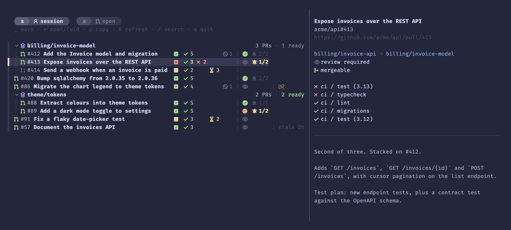
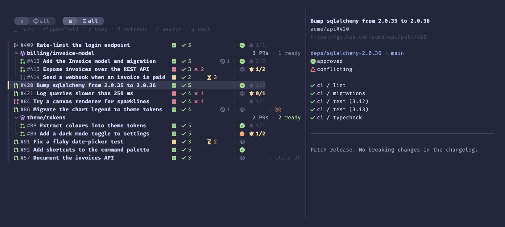

# pr-tracker

[](https://github.com/wmxscott/pr-tracker/actions/workflows/ci.yml)

Keeps track of the pull requests your coding agents open, keeps their status fresh in the background, and tells the agent session that opened a PR when its checks or reviews change.



*`prs` in one agent session: two stacks and four standalone PRs, with checks, reviews and undelivered events at a glance, and the highlighted PR's failing checks in the preview.*

An agent that opens a PR usually moves on and forgets it. A few minutes later CI goes red, or a reviewer asks for changes, and nobody tells the agent. pr-tracker closes that loop. It records every PR a session creates, polls GitHub for their checks and reviews, and hands the changes back to the session as context on its next tool call. You don't type anything. `prs` shows the whole set in an fzf picker, with stacked PRs grouped under their base.

## Why not `gh pr list` or `gh dash`?

They answer "which PRs exist?". pr-tracker answers "what did *this session* open, and where does each one stand?". That link between an agent session and its PRs exists nowhere else, so pr-tracker keeps it: one SQLite ledger, with the session as a filter over every PR your agents have opened.

## How it works

1. **Record.** An agent hook runs `pr-tracker hook` after every shell command and every GitHub MCP `create_pull_request` call. When the command was `gh pr create`, `gh stack submit` or `gh stack push`, it takes the PR URL from the output and writes a row. A URL that `gh pr view` or `gh pr list` merely printed is never recorded. Recording is offline: no network, no `gh`, a few milliseconds.
2. **Refresh.** A background service runs `pr-tracker refresh` every minute. It does nothing until `interval_seconds` (5 minutes by default, give or take some jitter) has passed, then asks GitHub about every open PR with one batched GraphQL query per repository. No open PRs means no network call.
3. **Notify.** When a PR's checks go red or green, a review comes in, or it's merged or closed, the refresh queues an event for every session that owns it. The same hook delivers queued events into the session's context on its next tool call. A PR's first refresh is silent: "all checks passing" for a PR opened a minute ago isn't news.
4. **Browse.** `prs` opens the picker.

Anything the hook didn't see, like a PR opened in the browser or by an earlier session, can be attached with `pr-tracker adopt`.

Design notes: [docs/design.md](docs/design.md).

## Install

pr-tracker needs:

- [`gh`](https://cli.github.com), logged in (`gh auth login`). The refresh uses it for every GitHub call, so pr-tracker never handles a token itself.
- [`fzf`](https://github.com/junegunn/fzf) 0.59 or later, for the picker. Without it, `prs` prints the list instead.
- A [Nerd Font](https://www.nerdfonts.com) in your terminal, for the picker's icons.

### Homebrew

```sh
brew install wmxscott/tap/pr-tracker
brew services start pr-tracker
```

The service runs `pr-tracker refresh` every 60 seconds, from now on and at every login. Homebrew installs `gh` and `fzf` too.

### From source

Needs Python 3.11 or later.

```sh
uv tool install git+https://github.com/wmxscott/pr-tracker
# or: pipx install git+https://github.com/wmxscott/pr-tracker
```

Then have something run `pr-tracker refresh` every minute or so. On macOS, load the example launch agent. It expects `pr-tracker` in `~/.local/bin`:

```sh
cp contrib/io.github.wmxscott.pr-tracker.plist ~/Library/LaunchAgents/
launchctl bootstrap "gui/$(id -u)" ~/Library/LaunchAgents/io.github.wmxscott.pr-tracker.plist
```

Elsewhere, a cron entry does the same job: `* * * * * $HOME/.local/bin/pr-tracker refresh`.

## Agent integration

pr-tracker works with Claude Code, Codex and Pi. The `pr-tracker@ai-toolkit` plugin from [ai-toolkit](https://github.com/wmxscott/ai-toolkit) wires it into each: it registers the hooks, adds a `/prs` command that lists the session's PRs in the conversation, and teaches the agent to `adopt` PRs the hooks missed. For Claude Code:

```sh
claude plugin marketplace add wmxscott/ai-toolkit
claude plugin install pr-tracker@ai-toolkit
```

See ai-toolkit for Codex and Pi. Codex's hooks send the same JSON as Claude Code's, plus a few keys of their own, so Codex runs `pr-tracker hook` directly. In Pi, the plugin's extension builds that JSON from Pi's tool events and pipes it to `pr-tracker hook --agent pi`. Any other agent can integrate the same way, through [the hook contract](#the-hook-contract).

To wire the hooks into Claude Code yourself, add this to `~/.claude/settings.json`:

```json
{
  "hooks": {
    "PostToolUse": [
      {
        "matcher": "Bash",
        "hooks": [{ "type": "command", "command": "pr-tracker hook post-bash", "timeout": 10 }]
      },
      {
        "matcher": "mcp__.*github.*__create_pull_request",
        "hooks": [{ "type": "command", "command": "pr-tracker hook post-mcp", "timeout": 10 }]
      }
    ],
    "Stop": [
      {
        "hooks": [{ "type": "command", "command": "pr-tracker hook stop", "timeout": 10 }]
      }
    ]
  }
}
```

### The hook contract

`pr-tracker hook` reads Claude Code's hook JSON. That input is the stable, agent-neutral contract: Codex sends it natively, and an adapter for any other agent builds it and pipes it in.

| Command | Runs after | Does | Prints |
|---|---|---|---|
| `pr-tracker hook post-bash` | A shell tool call | Records a PR the command created, then delivers queued events | `{"hookSpecificOutput": {"hookEventName": "PostToolUse", "additionalContext": "..."}}` |
| `pr-tracker hook post-mcp` | A GitHub MCP `create_pull_request` call | Records the new PR, then delivers queued events | The same |
| `pr-tracker hook stop` | The end of a turn | Shows undelivered events to you, leaving them queued for the agent | `{"systemMessage": "..."}` |
| `pr-tracker hook` | Any of the above | Picks the mode from the payload's `hook_event_name` and `tool_name` | As above |

**Input:** one JSON object on stdin. Every other key is ignored, so a real agent's payload can carry more.

| Field | | Used for |
|---|---|---|
| `session_id` | Required | The session to record under and deliver to. Without it, the hook does nothing |
| `hook_event_name` | Optional | Mode inference: `PostToolUse` or `Stop`. Also echoed as `hookEventName` in the output |
| `tool_name` | Optional | Mode inference: `Bash`, `shell`, `local_shell`, `exec_command` or `run_shell_command` (any case) is a shell call; a name ending in `create_pull_request` is a GitHub MCP call |
| `tool_input.command` | Shell calls | The command, as a string or an argv list. Only `gh pr create`, `gh stack submit` and `gh stack push` record anything |
| `tool_response` | When recording | Any shape. PR URLs are read from every string in it |
| `cwd` | Optional | Stored with the PR, and where `gh stack view` runs |
| `agent_id` or `subagent_id` | Optional | Marks a subagent's call: it records but never delivers |
| `turn_id` | Optional | Marks a Codex payload, for the agent label |

A minimal shell call, as an adapter would send it:

```json
{
  "session_id": "abc123",
  "cwd": "/path/to/repo",
  "hook_event_name": "PostToolUse",
  "tool_name": "bash",
  "tool_input": { "command": "gh pr create --fill" },
  "tool_response": { "output": "https://github.com/owner/repo/pull/42" }
}
```

At the end of a turn, `{"session_id": "abc123", "hook_event_name": "Stop"}` is enough.

- **Output:** nothing, or exactly one JSON object on stdout when there's something to deliver: `hookSpecificOutput.additionalContext` after a tool call, for the agent's context, or `systemMessage` at `Stop`, for you. Nothing on stderr. An adapter hands `additionalContext` to its agent and shows `systemMessage` to you.
- **Exit status:** always 0. A bad payload, a locked or broken ledger, a full disk: all of them exit 0 with no output. A PR tracker isn't worth breaking a tool call over.
- **Speed:** no network, ever. With nothing tracked it costs interpreter startup plus a file check, about 30 ms. The ledger waits at most 3 seconds for a lock, so a 10-second hook timeout is plenty.
- **Subagents:** a payload with `agent_id` or `subagent_id` records its PR but never delivers events. Anything delivered there would vanish with the subagent's context.
- **Stop never blocks** the turn. It only peeks; the next tool call delivers the events into the agent's context.
- **`--agent NAME`** labels a new session in the ledger. Without it, the label is inferred: `codex` for a payload with `turn_id`, which Codex adds to every turn's hook input and Claude Code doesn't, else `claude`. Adapters for other agents pass it, like `--agent pi`. It's only a label; it changes nothing else.
- **`PR_TRACKER_DISABLE=1`** turns every hook into a no-op.

### Sessions outside the hook

Commands that act on a session (`list --scope session`, `adopt`, `record`, `drain`, `untrack`, and the picker) take `--session ID`. Without it, they use the first of these that is set:

1. `PR_TRACKER_SESSION_ID`, an explicit override
2. `CODEX_SESSION_ID`, which Codex exports to its shell commands
3. `PI_SESSION_ID`, which Pi exports to its shell commands
4. `CLAUDE_CODE_SESSION_ID`, which Claude Code exports to its Bash tool, with the parent's id inside a subagent
5. `CLAUDE_SESSION_ID`, for older integrations

So an agent can run `pr-tracker list --scope session` or `pr-tracker adopt` with no flags. An agent run from inside another inherits the outer one's variable too, so the agents most often run as delegates, like Codex from Claude Code, come first. Set `PR_TRACKER_SESSION_ID` when that order is wrong for you. `adopt` and `record` label a new session with the agent whose variable supplied it. With no session at all, these commands exit 1 and say so; the picker shows every open PR instead.

## The picker

```sh
prs                      # PRs for the session in the environment, or every open PR without one
prs --session <id>       # PRs for that session
prs --print              # print the list once, no fzf
```

| Key | Does |
|---|---|
| `j` / `k` | Move |
| `space` | Mark a PR, or on a stack's header, the whole stack |
| `enter` | Open the marked PRs in your browser, or with none marked, fold a stack |
| `y` | Copy the marked URLs, or the highlighted one |
| `s` | Switch between this session's PRs and every tracked PR |
| `a` | Cycle through open, needs attention, merged or closed, and all |
| `R` | Refresh now, and mark every pending event delivered |
| `/` | Search. `j`, `k` and the other keys type letters until `esc` |
| `esc` | Leave search, else clear marks, else quit |
| `q` | Quit |

Each row shows the PR's state, number and title, then three groups of status: what CI thinks (a verdict, then pass, fail, pending and skipped counts), what people think (the review verdict, and how many of its events have reached the session, like `2/3`), and what's wrong with the PR itself (a lost base branch, or `stale` when refreshes have been failing). *Needs attention* means an open PR with failing checks, changes requested, or undelivered events. The preview shows the branches, review and merge state, every check with failures first, and the description.

A PR whose base branch is another tracked PR's head is shown under it, so stacks from `gh stack`, Graphite or plain git all group the same way. When the opening view is empty, the picker widens the state filter before it gives up the session filter, so a session whose PRs have all merged still opens on its own PRs.



*`s` and `a` widened to every session's PRs in every state: a merged and a closed PR, and another session's work, join the list.*

`R` marks events delivered without the owning agent ever seeing them. Use it when you've dealt with them yourself.

Colours follow your system's light or dark mode at launch: read from [theme-monitor](https://github.com/wmxscott/theme-monitor) if it's running, else from macOS. Set `picker.theme` or `PR_TRACKER_THEME` to `light` or `dark` to choose.

## Configure

Every setting is optional. The file lives at `~/.config/pr-tracker/settings.toml`, or `$XDG_CONFIG_HOME/pr-tracker/settings.toml`. Set `PR_TRACKER_CONFIG` to use another path.

| Setting | Default | |
|---|---|---|
| `refresh.interval_seconds` | `300` | Seconds between refreshes |
| `refresh.jitter_seconds` | `30` | Each refresh comes due up to this many seconds early or late, so machines don't poll in lockstep |
| `refresh.stale_after_multiple` | `2` | The picker marks a PR `stale` once its last good refresh is older than `interval_seconds` times this |
| `retention.terminal_ttl_days` | `30` | Days a merged or closed PR stays in the ledger |
| `notify.post_tool_use` | `true` | Deliver events into the session on its next tool call |
| `notify.stop_surface` | `true` | Show undelivered events when a turn ends |
| `picker.theme` | `"auto"` | `"auto"`, `"light"` or `"dark"` |

A complete file, every setting at its default:

```toml
# ~/.config/pr-tracker/settings.toml

[refresh]
interval_seconds = 300
jitter_seconds = 30
stale_after_multiple = 2

[retention]
terminal_ttl_days = 30

[notify]
post_tool_use = true
stop_surface = true

[picker]
theme = "auto"
```

The file is read on every run, so changes apply straight away. The service's 60-second tick is how often pr-tracker *checks* whether a refresh is due; `interval_seconds` is how often one happens. A bad value is reported by `pr-tracker status` and replaced by its default. It never stops the hook.

## Commands

| Command | |
|---|---|
| `pr-tracker refresh` | Refresh if one is due. This is what the service runs. `--force` refreshes now |
| `pr-tracker status` | Show the ledger, the last refresh, and any refresh failures or config problems |
| `pr-tracker list` | Print tracked PRs as JSON, each stack in order. `--scope open` (the default), `all` or `session` |
| `pr-tracker adopt [URL \| NUMBER]` | Attach a PR to a session. With no argument, the current branch's PR |
| `pr-tracker untrack REF` | Detach a PR from a session, or with `--all-sessions`, forget it. `REF` is a URL or `owner/repo#123` |
| `pr-tracker pick` | The picker, the same as `prs` |
| `pr-tracker hook [MODE]` | The agent hook. See above |
| `pr-tracker record` | Attach PR URLs to a session, from `--url` or from text with `--text` (`-` reads stdin) |
| `pr-tracker drain` | Print a session's pending events and mark them delivered. `--peek` leaves them queued |
| `pr-tracker flush` | Mark pending events delivered without printing them |
| `pr-tracker init` | Create or upgrade the ledger. Other commands do this when they need to |

Commands that act on a session take `--session ID`. Without it, they read it from the environment, as [above](#sessions-outside-the-hook).

## Files

| Path | |
|---|---|
| `~/.config/pr-tracker/settings.toml` | Settings. Follows `$XDG_CONFIG_HOME`; `$PR_TRACKER_CONFIG` overrides it |
| `~/.local/state/pr-tracker/prs.db` | The ledger, a SQLite database. Follows `$XDG_STATE_HOME`; `$PR_TRACKER_STATE_DIR` overrides the directory |
| `~/.local/state/pr-tracker/refresh.lock` | Keeps two refreshes from overlapping |
| `$(brew --prefix)/var/log/pr-tracker.log` | Service log, with Homebrew. It records when a repository's refresh starts or stops failing, not every tick |

## herdr

pr-tracker doesn't need [herdr](https://herdr.dev), but the two fit well: one key opens `prs` in a herdr popup, scoped to the agent in the pane you were looking at. The popup gets the session through `PR_TRACKER_SESSION_ID`. Without a session, `prs` shows every open PR.

There are two ways to set it up.

### A plugin of your own

A herdr plugin is a directory with a manifest. Put these two files in one, anywhere you like, such as `~/herdr-plugins/prs/`.

`herdr-plugin.toml` declares a popup pane that runs `prs`, and an action that opens it:

```toml
id = "prs"
name = "Session PRs"
version = "0.1.0"
min_herdr_version = "0.7.4"
platforms = ["linux", "macos"]

[[panes]]
id = "picker"
title = "pull requests"
placement = "popup"
width = "100%"
height = "80%"
command = ["prs"]

[[actions]]
id = "open"
title = "Open session PRs"
contexts = ["workspace"]
command = ["python3", "open-prs.py"]
```

`open-prs.py` is the action. It finds the agent session in the focused pane, then opens the pane with `PR_TRACKER_SESSION_ID` set to it:

```python
import json
import os
import subprocess

herdr = os.environ.get("HERDR_BIN_PATH", "herdr")
context = json.loads(os.environ.get("HERDR_PLUGIN_CONTEXT_JSON") or "{}")

plugin = os.environ["HERDR_PLUGIN_ID"]
args = [herdr, "plugin", "pane", "open", "--plugin", plugin, "--entrypoint", "picker", "--focus"]
if context.get("focused_pane_agent"):
    listing = subprocess.run([herdr, "agent", "list"], capture_output=True, text=True).stdout
    for agent in json.loads(listing or "{}").get("result", {}).get("agents", []):
        session = agent.get("agent_session") or {}
        if agent.get("pane_id") == context.get("focused_pane_id") and session.get("value"):
            args += ["--env", f"PR_TRACKER_SESSION_ID={session['value']}"]
subprocess.run(args)
```

herdr runs both commands from the plugin's directory. Register the plugin, then bind the action to a key in herdr's `config.toml`:

```sh
herdr plugin link ~/herdr-plugins/prs
```

```toml
[[keys.command]]
key = "prefix+P"
type = "plugin_action"
command = "prs.open"
description = "session PRs"
```

### herdr-launchpad

[herdr-launchpad](https://github.com/wmxscott/herdr-launchpad) is a herdr plugin that opens terminal tools in popups, from an icon picker or a key, and can hand them the focused pane's agent session. With it installed, `prs` is one entry in its config file, `$(herdr plugin config-dir launchpad)/config.toml`:

```toml
[[entries]]
id = "prs"
title = "pull requests"
command = ["prs"]
icon = "\ue726"
color = "mauve"
width = "100%"
height = "80%"
slot = 1
session_env = "PR_TRACKER_SESSION_ID"
```

`session_env` sets `PR_TRACKER_SESSION_ID` to the session of the agent in the focused pane. Add `requires_session = true` to offer `prs` only in panes running an agent. `slot = 1` lets a key open it directly:

```toml
[[keys.command]]
key = "prefix+P"
type = "plugin_action"
command = "launchpad.slot-1"
description = "session PRs"
```

## Limitations

- **GitHub.com only**, through `gh`.
- **Tested on macOS.** CI also runs on Linux. The picker opens URLs with `open` or `xdg-open`, and copies with `pbcopy`, `wl-copy`, `xclip` or `xsel`.
- **`gh stack view --json`:** pr-tracker reads the shape gh-stack emits today (`branches[].pr.url`). A scan that succeeds but finds no PRs is logged, so a change in that shape shows up instead of silently losing stacks.
- **Subagent session ids:** a PR opened inside a subagent is recorded under the `session_id` its hook payload carries. That's expected to be the parent session's, but it hasn't been confirmed for every agent.

## Development

```sh
uv sync
uv run pytest
uv run ruff check && uv run ruff format --check
```

The tests run against a temporary `HOME` with a fake `gh` first on `PATH`, so they never read your ledger or reach GitHub. `tests/test_refresh.py` drives batching, events and failures through that fake, and `tests/test_hook.py` checks the hook contract through the real entry point.

### Regenerating the screenshots

The screenshots show made-up PRs. `scripts/demo-ledger.py` seeds a throwaway ledger, and `scripts/demo --vhs` renders it with [VHS](https://github.com/charmbracelet/vhs) from `docs/screenshots/prs.tape`, in an empty environment with a `gh` that always fails. It needs `brew install vhs`, fzf and FiraCode Nerd Font. `scripts/demo` on its own opens the same picker in your terminal.

## License

[MIT](LICENSE)
